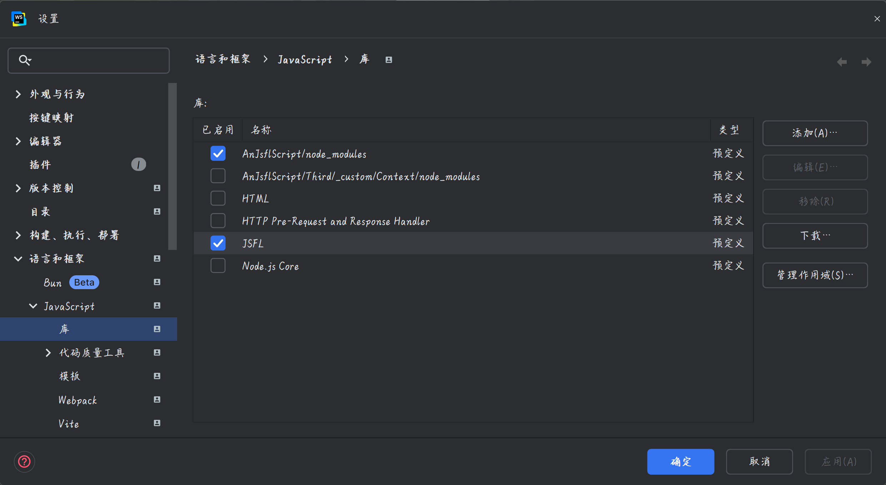

由于flash的类型与 HTML的类型 有很大一部分都是重复的,导致编辑器的类型跳转总是不正确。

# 解决方案

## 安装 "JSFL Support" plugin：

// Getting started
// 1. Install "JSFL Support" plugin: File > Settings > Plugins > Marketplace > JSFL Support
// 2. Enable global JSFL library: File > Settings > Libraries & Frameworks > JavaScript > Libraries > JSFL

## global JSFL library 的设置



关闭 html相关提示

## typescript 第三方库的处理

```
npm uninstall typescript
npm install -g typescript
```

所有的 node_modules 都不能包含 typescript库，安装到 全局

## nodejs 的提示

删除 node_modules/@types/node

## jsfl-typescript 库的处理

types/jsfl-typescript  文件夹忽略，保证 提示的是 "JSFL Support" plugin的提示

jsfl.d.ts 暂时提示不完整

## 总结

尽量删除 Document 的 html 的提示文件，保证 "JSFL Support" plugin 可以正常提示


