# AnJsflScript - Adobe Animate 自动化脚本工具集

[](https://github.com/rabit2022/AnJsflScript)
[](https://github.com/rabit2022/AnJsflScript/pulls)
[](https://www.adobe.com/products/animate.html)
[](https://www.gnu.org/licenses/gpl-3.0)
[](https://github.com/rabit2022/AnJsflScript/tree/tools)

## 内容导航

- [✨ 核心功能](#-核心功能)
- [🚀 快速安装](#-快速安装)
- [🛠️ 使用指南](#-使用指南)
- [📁 项目结构](#-项目结构)
- [⚠️ 重要提示](#-重要提示)
- [🤝 参与贡献](#-参与贡献)
- [🔗 相关资源](#-相关资源)
- [📈 项目数据](#-项目数据)

------

## ✨ 核心功能

✔ **自动化工作流** - 简化重复性动画制作任务  
✔ **模块化架构** - 基于RequireJS的模块系统  
✔ **跨版本兼容** - 支持Animate 2024
✔ **完整类型支持** - 提供TypeScript类型定义  
✔ **丰富工具集** - 100+实用脚本

------

## 🚀 快速安装

### Windows用户安装选项

#### 方式1：一键安装（推荐）

1. 从[发布页面](https://github.com/rabit2022/AnJsflScript/releases)下载安装包
2. 解压到项目根目录
3. 双击`Setup.exe`完成安装

#### 方式2：开发者安装

```bash
git clone https://github.com/rabit2022/AnJsflScript.git
```

#### 方式3：手动安装

1. [下载ZIP包](https://github.com/rabit2022/AnJsflScript/tags)
2. 解压到任意目录

### 每次使用

1. 启动Adobe Animate 2024
2. 新建/打开FLA文档
3. **必须**先运行`FirstRun.jsfl`

> 💡 提示：所有操作需在文档打开状态下进行

------

## 🛠️ 使用指南

### 标准工作流

```mermaid
graph LR
    A[启动Animate] --> B[打开文档]
    B --> C[运行FirstRun]
    C --> D[执行功能脚本]
```



### 核心脚本

| 脚本              | 功能    | 重要度   |
|-----------------|-------|-------|
| `FirstRun.jsfl` | 环境初始化 | ★★★★★ |
| `ReRun.jsfl`    | 缓存重置  | ★★★☆☆ |

### 调试技巧

1. 使用`ReRun.jsfl`清除缓存
2. 查看输出面板日志
3. 添加`console.log()`调试

------

## 📁 项目结构

```
AnJsflScript/
├── config/          # 配置文件
├── core/           # 核心模块
├── lib/            # 功能脚本
├── third/          # 第三方库
├── types/          # 类型定义
├── FirstRun.jsfl   # 主入口
└── ReRun.jsfl      # 缓存管理
```

------

## ⚠️ 重要提示

❗ **系统要求**

- Windows 11系统
- Animate 2024

❗ **必做事项**

1. 文档必须先打开
2. 每次启动必须运行`FirstRun.jsfl`

🔧 **常见问题**  
Q：脚本不生效？  
A：1. 检查是否运行了FirstRun且文档已打开；2. 系统要求是否满足，由于条件有限，只测试了当前使用的系统，其他系统无法保证兼容性。3.请联系作者或提交issue。

------

## 🤝 参与贡献

### 开发流程

1. Fork仓库
2. 创建特性分支
3. 提交PR请求

### 支持渠道

- [github issues](https://github.com/rabit2022/AnJsflScript/issues)
- QQ群：1040730457
- 邮箱：3101829204@qq.com

------

## 🔗 相关资源

### 核心依赖

[](https://requirejs.org)
[](https://github.com/es-shims/es5-shim)

### 推荐项目

[](https://gitee.com/ninge/WindowSWF/tree/master/)
[](https://github.com/davestewart/xJSFL)
[](https://github.com/hufang360/FlashTool)


------

## 📈 项目数据

- **代码行数**: 13738
- **字符数量**: 378660
- **脚本数量**: 120
- 依赖库：37个
- 访问量：

------

## 关于作者

[](https://space.bilibili.com/453222786?spm_id_from=333.788.0.0)
[](https://github.com/rabit2022)

**联系我**：  
📧 3101829204@qq.com  
👥 QQ群：1040730457

[//]: # (🎥 [B站主页]&#40;https://space.bilibili.com/453222786&#41;)
🥠[](https://space.bilibili.com/453222786?spm_id_from=333.788.0.0)