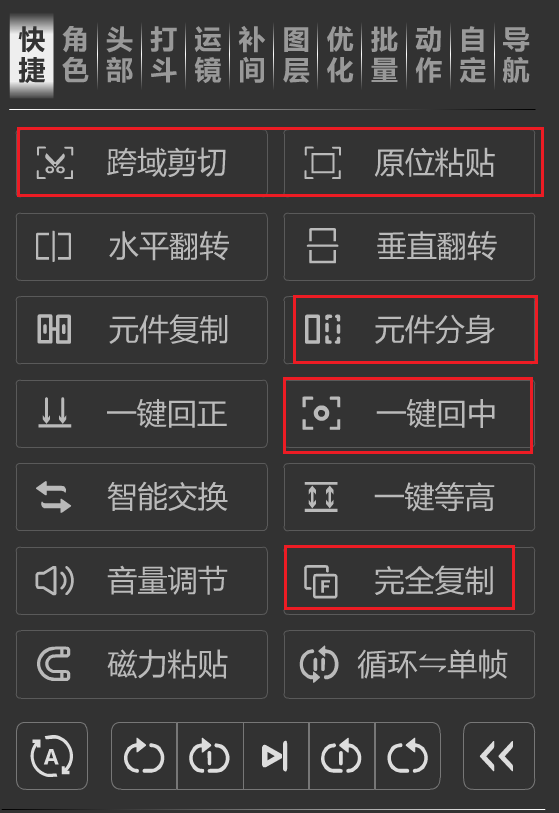
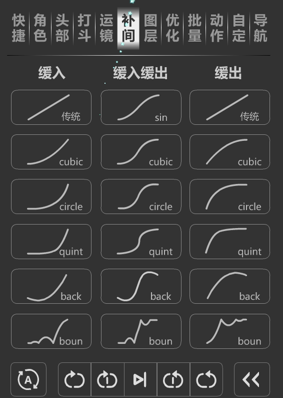
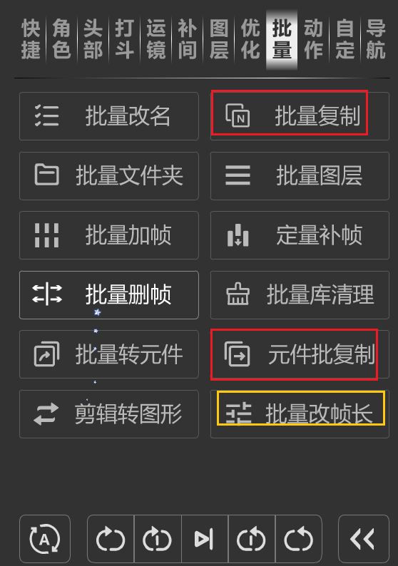
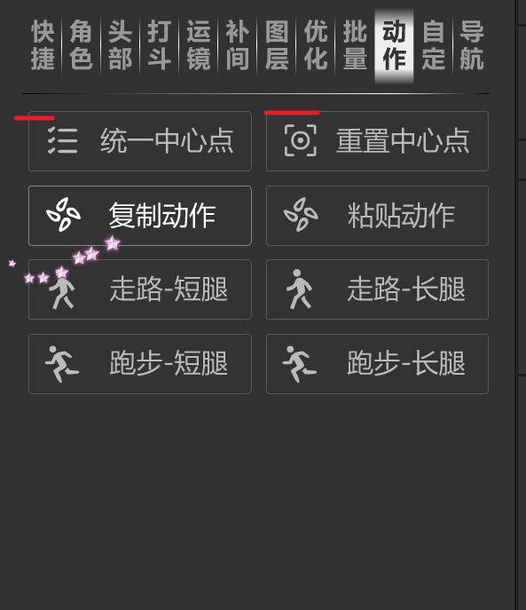

# 1,软件安装

* adobe animate 2024 -- an的使用
* jetbrains ide -- rider,各种实用的插件
* github -- steam++

# 2,前置知识

jsfl
中文文档

+ jsfl与as的区别
    + 运行环境：
        + JSFL：JSFL脚本是在Flash编辑环境下运行的，用于自动化Flash IDE（集成开发环境）中的任务，如批量处理、创建图层、编辑库项目等。
        + AS：ActionScript脚本是在SWF文件运行时执行的，用于控制Flash动画和交互功能，如响应用户输入、控制时间轴动画等。
    + 用途：
        + JSFL：主要用于Flash文档的自动化处理，可以执行如批量修改、文件操作、创建和管理Flash文档等任务。
        + AS：主要用于Flash动画和游戏的开发，处理用户交互、网络通信、多媒体内容控制等。

```text
您可以通过使用 MMExecute() 函数，将各个 JavaScript API 命令添加到 ActionScript 文件中，具体说明请参阅
《ActionScript 3.0 语言和组件参考》。不过， MMExecute() 函数仅在自定义用户界面元素 （如创作环境中的组件属性检查器
或 SWF 面板）的上下文中使用时才有效。在 Flash Player 中或在创作环境外部，即使从 ActionScript 进行了调用，
JavaScript API 命令也无效。
```

# 3,目标

+ 1,实现 简单的 脚本
+ 2,完成 市面插件的简单功能的编写
    - 只有简单的功能，批量操作的实现
    - 复杂的功能，需要时间调试，急需请购买市面上的插件

  
  
  
  

+ 3,培养 编程能力
+ 5,流程：
    - 演示插件的使用 -- 效果
    - 讲解手动的实现过程 -- 思路
    - 讲解 代码实现 -- 代码
        - 已经写好的代码，以免浪费时间
+ 6，没有插件页面的实现，请参考其他教程
  后期可能会有插件页面的实现 -- 待定
+ 7，中等难度，技术有一定的门槛
  先熟悉an的使用，有需求学习插件开发
+ 8，分享代码，分享思路和过程
  https://github.com/rabit2022/AnJsflScript

# 4,介绍

创建新的工程，新的脚本
怎么运行

```javascript
fl.trace("hello world");
```

+ 插件 jsfl 的安装
+ utils模版
+ 文件头
  编辑器 -- 设置 -- 编辑器 -- 文件模板 -- 其他语言 -- Jsfl Command

```javascript
/**
 * @file: ${FILE_NAME}
 * @author: 穹的兔兔
 * @email: 3101829204@qq.com
 * @date: ${DATE} ${TIME}
 * @project: ${PROJECT_NAME}
 * @description: ${END}
 */


```

# 6,一些技巧

模版介绍

+ 1,文档注释的重要性

方便编辑器的自动提示，提高编程效率。

```javascript
// /**
//      * 
//      * @type {Element[]}
//      */
    var seles=[];
    for(var i=0;i<selection.length;i++){
        sels.push(selection[i]);
    }
    
    seles.forEach(function(sel){
    })
    
    for(var i=0;i<seles.length;i++) {
        var sel = seles[i];
    }


```

+ 2,正确的理解Element对象
+ 3，更加智能的提示
+ 4，警告：文档并不完整

```javascript
    // 13.循环单帧.jsfl

```

+ 5，支持的功能有限

```javascript
    // AI 自动生成代码
    var a=new String("hello world")
    // // can not use
    // fl.trace(a.endsWith("world"));//2015
    // fl.trace(a.includes("world"));//2015
    // fl.trace(a.padStart(100,"0"));//2017
    // fl.trace(a.trimRight("world"));//2019
    // fl.trace(a.matchAll("world"));//2020
    // fl.trace(a.replaceAll("world"));//2021
    // fl.trace(a.at(2));//2022

    
    // can use
    fl.trace(a.charAt(2));//es5
```

```javascript
// JavaScript 类（class）的概念是在 ECMAScript 2015（也称为 ES6）中引入的。

class Animal {
    constructor(name) {
        this.name = name;
    }

    speak() {
        console.log(`${this.name} makes a noise.`);
    }
}

var animal = new Animal("Lion");
animal.speak();

// 构造函数和原型链  es5
// 构造函数
function Person(name) {
    this.name = name;
}

// 在原型上定义方法
Person.prototype.sayHello = function() {
    console.log('Hello, my name is ' + this.name);
};

// 创建实例
var person = new Person('Kimi');
person.sayHello(); // 输出: Hello, my name is Kimi
```

为什么必须先运行 FirstRun.jsfl 脚本？
任意文件的所有全局的 方法，类，变量，只要运行一次，就能在其他文件中使用。
不清楚做出插件后，这个特性是否还存在。

+ 6，常见类Point的封装

```javascript
    // 06.一键聚焦.jsfl
```

```text
JavaScript API 对象

Document 对象 Document 对象表示舞台。--右键菜单，添加删除元素，最主要的功能。

Timeline 对象 Timeline 对象表示 Flash 时间轴，可通过 fl.getDocumentDOM().getTimeline() 访问当前文档的时间轴。
        --操作Layer对象，Frame对象
Layer 对象 Layer 对象表示时间轴中的图层。--只有属性，没有方法
Frame 对象 Frame 对象表示图层中的帧。--动画，补间相关


Element 对象 出现在舞台上的所有对象都是 Element 类型。
Instance 对象 Instance 对象是 Element 对象的子类。
SymbolInstance 对象 SymbolInstance 对象是 Instance 对象的子类，它表示帧中的一个元件。


library 对象 library 对象表示 “ 库 ” 面板。
Item 对象 Item 对象是一种抽象基类。
SymbolItem 对象 SymbolItem 对象是 Item 对象的子类。


```

+ 7,会者不难，难者不会
+ 语言只是一只笔，不是说，会用笔就能写出好文章，就能画出好画，
+ 重要的是思想，需要先知道怎么做，再去实现。

# 8,参考资料

* github 最新api
  https://github.com/AdobeDocs/developers-animatesdk-docs/blob/master/Layer_object/layer_summary.md
* 国外jsfl论坛地址
  https://community.adobe.com/t5/animate-discussions/unparent-layers-with-jsfl/m-p/14851064
* 中文文档
  [flash_cs5_extending中文版.pdf](../flash_cs5_extending中文版.pdf)

* 开源代码 b站up @见水中月：
  https://gitee.com/ninge/WindowSWF/tree/master/
* 我的地址：
  https://github.com/rabit2022/AnJsflScript

* actionscript 3.0 常用类
  https://help.adobe.com/zh_CN/FlashPlatform/reference/actionscript/3/adobe/utils/package.html#MMExecute()
